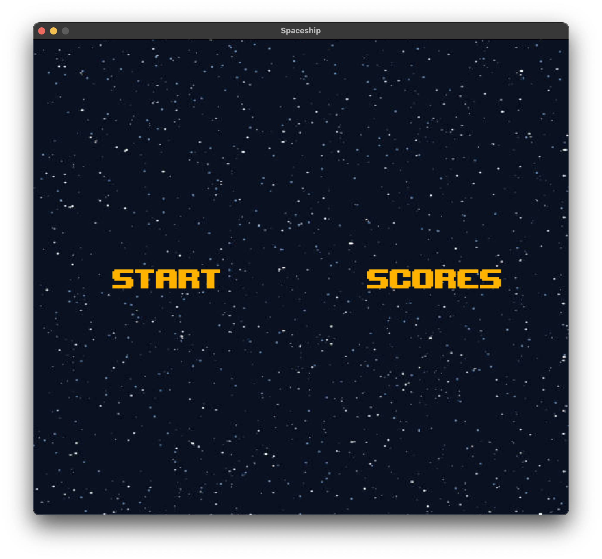
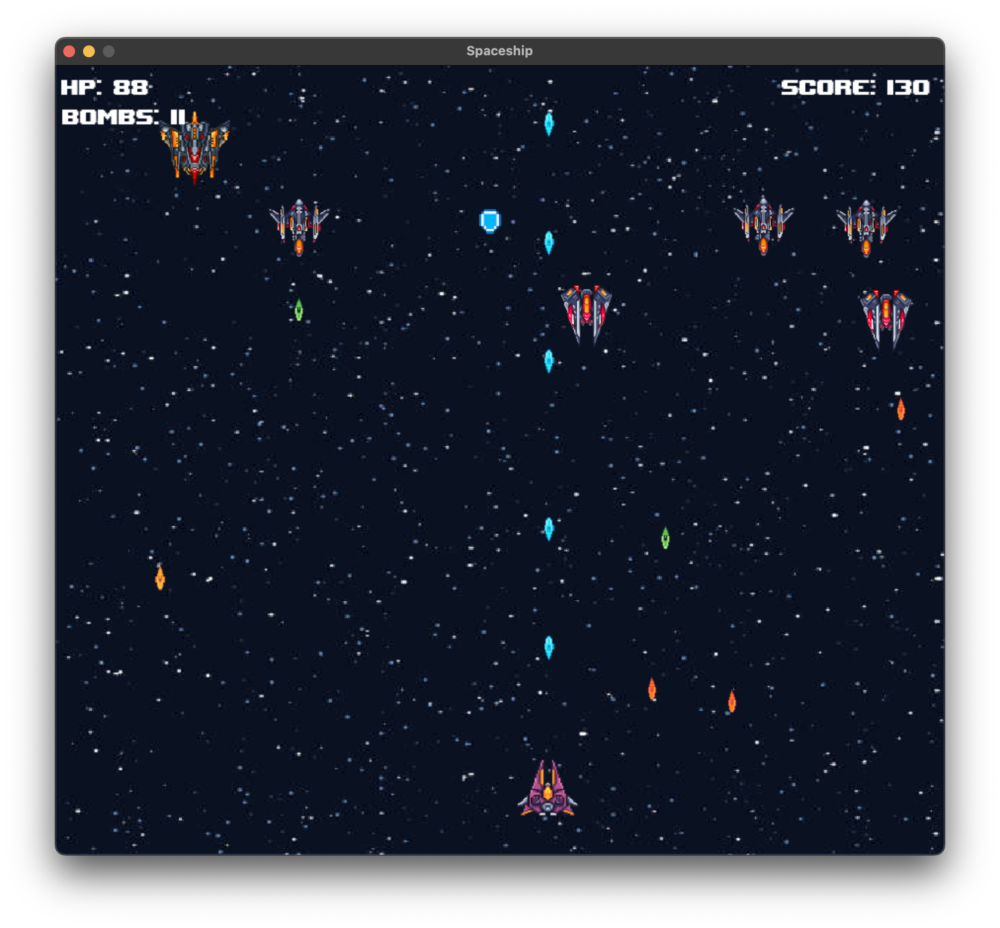

# Galaga/Space invaders inspired game in python

### Running the game
Clone the repository and run the `main.py` file. 

Press start to launch the game or scores to checkout the best results.

### In game

- Arrow keys - movement
- Spacebar - regular shots
- Q - sepcial missle (their amount is limited)

### Additional info

Different enemies have different amount of health, and damage that they deal to the player.
There are also boosters falling towards the player
- extra health
- bonus bombs

